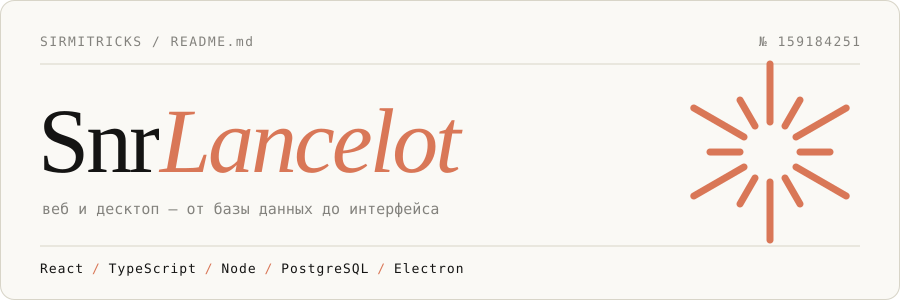
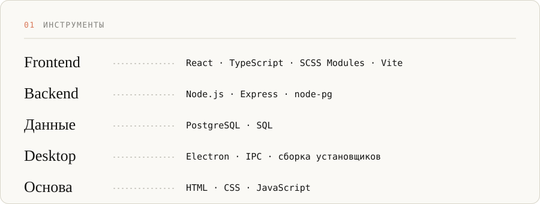
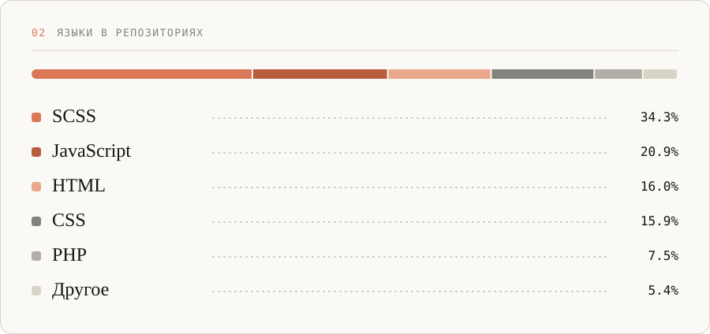

 

Пишу на TypeScript и JavaScript и люблю разбираться, что на самом деле происходит между базой данных и экраном — например, во что превращается `bigint` по дороге через Express в React. Собираю небольшие инструменты без лишнего: чтобы просто работали.

 

 

 

### 03 — Работы

**[PixelVU](https://github.com/SirMitricks/PixelVU)** — десктоп-приложение на Electron: конвертер пикселей в `vw` / `vh` и обратно. Полностью офлайн, есть портативная сборка и компактное окно.
Electron · HTML · JavaScript

**[TSX-helper](https://github.com/SirMitricks/TSX-helper)** — PostgreSQL → React. Разбор того, как каждый тип данных превращается в JSON и как правильно вывести его на фронтенде.
React · TypeScript · Express · PostgreSQL · SCSS Modules

 

<!-- Хочешь добавить контакты — раскомментируй и подставь свои:
### 04 — Связь
[Telegram](https://t.me/ТВОЙ_НИК) · [Email](mailto:you@example.com)
-->

